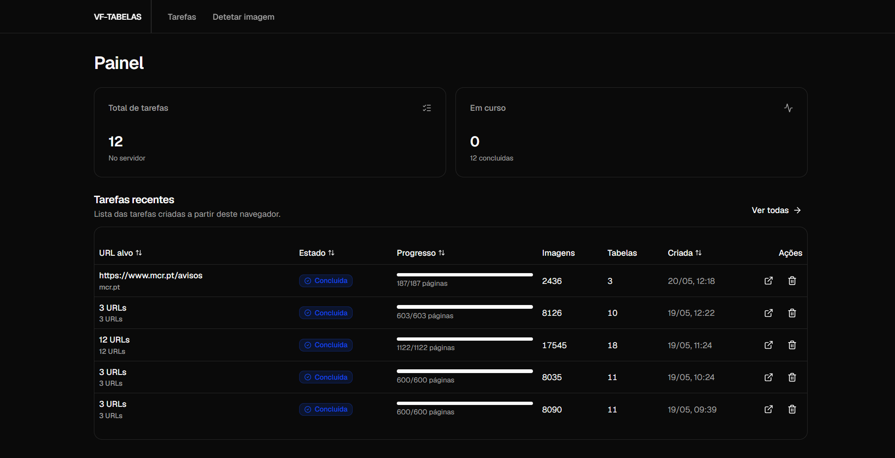
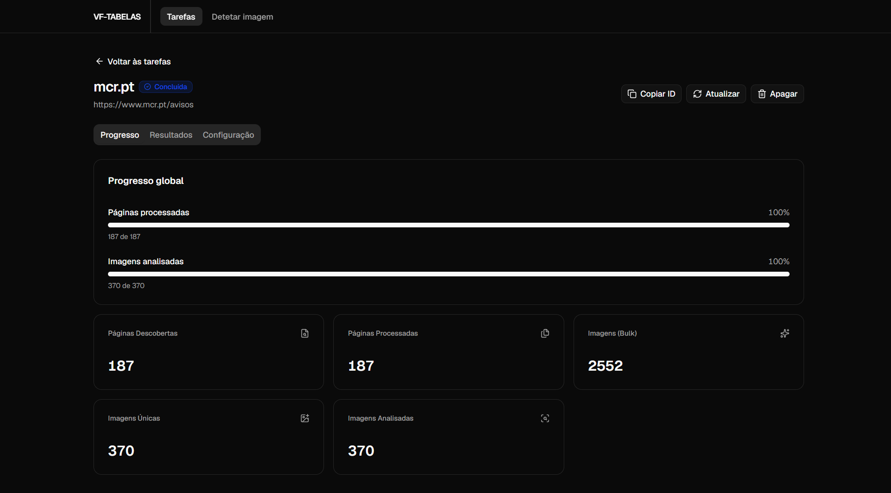

<div align="center">
   <h1>Deteção de Tabelas de Dados em Websites</h1>
   <p>
   
   
   
   
   
   
   
   
   </p>
</div>

Ferramenta para dar crawl a websites, extrair imagens e analisá-las utilizando **YOLO11** para identificar tabelas de dados.

---

## Como Iniciar

**Clone o repositório:**

```bash
git clone https://github.com/jauzin23/VF-tabelas.git
cd VF-tabelas
```

Altere as variáveis em `docker-compose.yml` e execute o compose:

```bash
docker compose up -d
```

---

## Utilização

Esta plataforma permite submeter tarefas de crawling e análise para identificar tabelas de dados em páginas web.

### Dashboard

No ecrã principal, pode submeter novos URLs e consultar o estado das tarefas na fila.

<div align="center">
  
</div>

### Detalhes da Tarefa

Ao clicar numa tarefa, pode ver as imagens analisadas e os resultados detalhados de deteção do modelo YOLO11.

<div align="center">
  
</div>

---

## Arquitetura e Funcionalidades

- Aceitação automática de cookies.
- Estabilização do DOM e limite de abas abertas (`BROWSER_CONCURRENCY`).
- Carregamento dinâmico do modelo (_Lazy Loading_) e descarregamento automático da RAM para otimização de recursos.
- Fila global para evitar sobrecarga de CPU e RAM no servidor.
- Exportação de dados para formato Excel ou CSV.

---

## Principais Variáveis de Configuração

Configuráveis no `docker-compose.yml`:

| Variável                  | Descrição                                               |
| :------------------------ | :------------------------------------------------------ |
| `API_KEYS`                | Chaves de API (separadas por vírgula).                  |
| `MAX_CONCURRENT_TASKS`    | Máximo de tarefas em execução ao mesmo tempo.           |
| `BROWSER_CONCURRENCY`     | Número máximo de abas abertas em simultâneo.            |
| `TABLE_MIN_CONFIDENCE`    | Confiança mínima do modelo para classificar uma tabela. |
| `YOLO_IMGSZ`              | Tamanho de redimensionamento da imagem na inferência.   |
| `CLEANUP_RESULTS_AFTER_S` | Segundos antes de limpar os resultados da memória.      |

---

## API Endpoints

Todos os endpoints (exceto o `/saude`) requerem autenticação por API Key.

### Tarefas

**`POST /api/tarefas`**: Cria e submete uma tarefa de crawl e análise.
**`GET /api/tarefas`**: Lista todas as tarefas.
**`GET /api/tarefas/{id_tarefa}`**: Detalhes, progresso e resultados de uma tarefa.
**`DELETE /api/tarefas/{id_tarefa}`**: Cancela e remove uma tarefa e os seus ficheiros do disco.
**`GET /api/tarefas/{id_tarefa}/eventos`**: SSE (Server-Sent Events) para progresso em tempo real.
**`GET /api/tarefas/{id_tarefa}/imagens`**: Detalhes simplificados das imagens de tabelas encontradas.

### Sistema e Modelo

**`POST /api/modelo/detetar-tabela`**: Envia uma imagem direta (multipart/form-data) para análise de IA.
**`POST /api/paginacao-multurls`**: Submete múltiplos URLs em lote para processamento.
**`GET /api/sistema/fila`**: Estado atual da fila de processamento.
**`GET /saude`**: Diagnóstico rápido do servidor (Público).
